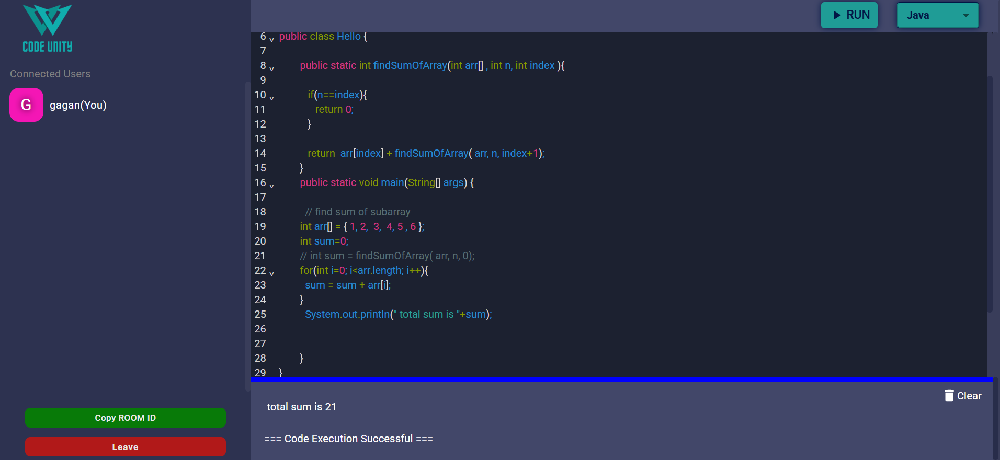
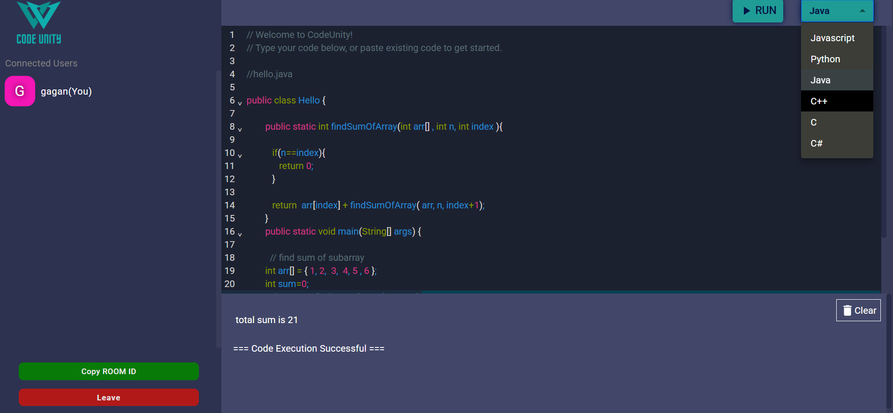
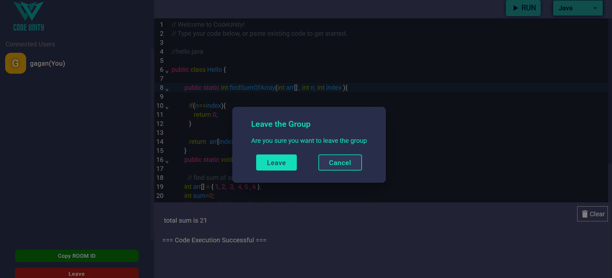

# Collaborative Code Editor

## Overview

This project is a real-time collaborative code editor built using React for the frontend and Node.js with Socket.IO for the backend. Users can join rooms, write code together, and see each other's changes in real-time, and execute their codes. The application utilizes CodeMirror for code editing and Material-UI for the user interface.

## Features

- **Real-time Collaboration**: Multiple users can join the same room and edit code simultaneously.
- **User  Management**: Users can join and leave rooms, and their presence is communicated to others in real-time.
- **Code Synchronization**: When a new user joins, they receive the current code from the room.
- **Multi-language Support**: Users can select from various programming languages such as Java, JavaScript, Python, C#, C++, and more for their coding sessions.
- **Responsive Design**: The application is designed to work on both desktop and mobile devices.

## Screen View

# ScreenShot 1


# ScreenShot 2


# ScreenShot 3



## Technologies Used

### Frontend

- **React**: A JavaScript library for building user interfaces.
- **Redux**: A state management library for managing application state.
- **Material-UI**: A popular React UI framework for building responsive layouts.
- **CodeMirror**: A versatile text editor implemented in JavaScript for the browser.
- **Socket.IO**: A library for real-time web applications, enabling real-time, bidirectional communication between web clients and servers.

### Backend

- **Node.js**: A JavaScript runtime built on Chrome's V8 JavaScript engine.
- **Express**: A web application framework for Node.js, designed for building web applications and APIs.
- **Socket.IO**: Used on the server-side to handle real-time communication.
- **CORS**: Middleware for enabling Cross-Origin Resource Sharing.

## Installation

### Prerequisites

- Node.js (v14 or higher)
- npm (Node Package Manager)


## Usage

1. Open the application in your browser.
2. Create or join a room using the provided Room ID.
3. Start coding! Changes made by any user will be reflected in real-time for all users in the room.
4. Select the programming language you want to use for coding.


### Clone the Repository

```bash
git clone https://github.com/Gaganshuyadav/collaborative-code-editor.git
cd collaborative-code-editor